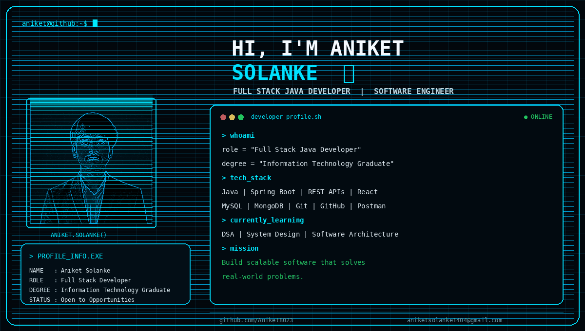

## 👨‍💻 About Me

I am an **Information Technology Graduate** focused on building reliable and scalable software applications.

- ☕ Java & Spring Boot
- 🔗 REST API Development
- ⚛️ React
- 🗄️ MySQL & MongoDB
- 🔐 Authentication & Authorization
- 🧠 DSA, System Design & Software Architecture
- 🚀 Interested in Software Engineering and Backend Development

## 🛠️ Tech Stack

## 🚀 Featured Projects

### 🏥 Hospital Management System
**Spring Boot • React • MySQL**

Patient management, doctor management, appointments, billing, inventory and role-based access control.

### 💼 Job Aggregator Platform
**Spring Boot • REST APIs • MySQL**

Job search, resume-based recommendations, location filtering, salary filtering and authentication.

### 🛒 Online Shopping System
**Spring Boot • MySQL**

Product management, authentication, REST APIs and database integration.

## 📊 GitHub Analytics

## 🐍 Contribution Snake

## 🌐 Connect With Me

<i>Code. Learn. Build. Repeat.</i>

